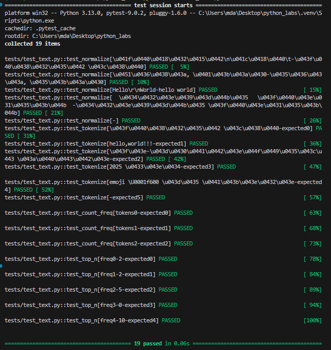
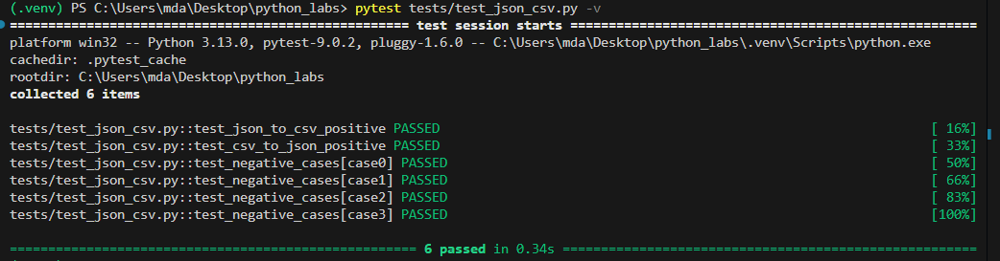
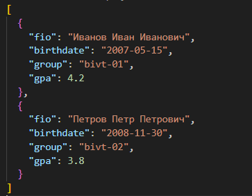
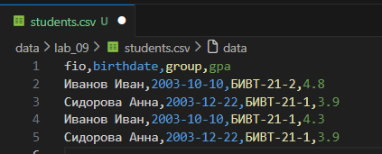
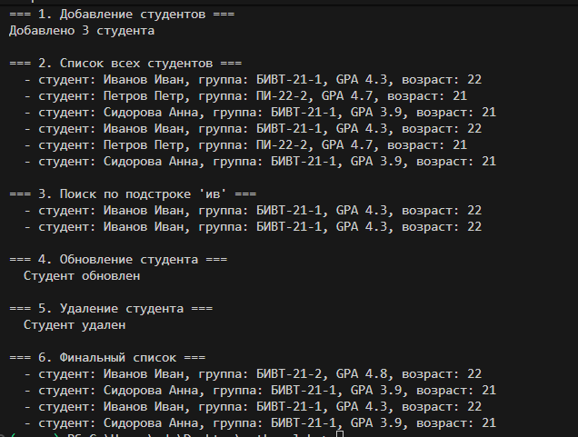
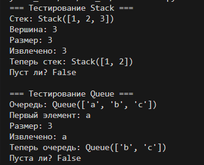
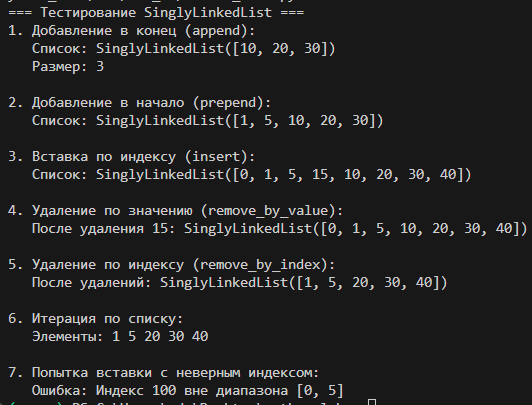

# python_labs

## Лабораторная работа 1

### Задание 1
```python
name = input('Имя: ')
age = int(input('Возраст: '))
print(f"Привет, {name}! Через год тебе будет {age + 1}.")
```


### Задание 2
```python
a = float(input("a: ").replace(',', '.'))
b = float(input("b: ").replace(',', '.'))
summ = a+b
average = round(summ / 2, 2)
print(f'sum={summ}; avg={average}')
```


### Задание 3
```python
price = float(input())
discount = float(input())
vat = float(input())
base = price * (1 - discount/100)
vat_amount = base * (vat/100)
total = base + vat_amount
print(f'База после скидки: {base:.2f} ₽')
print(f'НДС:               {vat_amount:.2f} ₽')
print(f'Итого к оплате:    {total:.2f} ₽')
```


### Задание 4
```python
m = int(input('Минуты: '))
print(f'{int(m/60)}:{int(m%60):02d}')
```


### Задание 5
```python
fio = input('ФИО: ').strip()
cl = ' '.join(fio.split())
ini = ''.join(x[0].upper() for x in cl.split())
print(f'Инициалы: {ini}\nДлина (символов): {len(cl)}')
```


### Задание 6
```python
N = int(input())
ochn = 0
zaochn = 0
for i in range(N):
    inf = input().split()
    if inf[-1] == 'True':
        ochn += 1
    else:
        zaochn += 1
print(f'out: {ochn} {zaochn}')
```
 

### Задание 7
```python
n = input('in: ')
out = ''
for i in range(len(n)):
    if n[i].isupper():
        out += (n[i])
        for j in range(i, len(n)):
            if n[j].isdigit():
                out += n[j+1]
                out += n[j+1+j+1-i::j+1-i]
                break
print(f'out: {out}')
```


## Лабораторная работа 2

### Задание 1
```python 
def min_max(nums):
    try:
        if nums == []:
            raise ValueError
        
        minimum = nums[0]
        maximum = nums[0]

        for i in range(len(nums)):
            if nums[i] < minimum:
                minimum = nums[i]
            if nums[i] > maximum:
                maximum = nums[i]

        return (minimum, maximum)
    except Exception as err:
        return repr(err)
print('min_max')
print(min_max([3, -1, 5, 5, 0]))
print(min_max([42]))
print(min_max([-5, -2, -9]))
print(min_max([]))
print(min_max([1.5, 2, 2.0, -3.1]))

def unique_sorted(nums):
    if nums == []:
        return []
    
    unique = []
    for x in nums:
        if x not in unique:
            unique.append(x)

    n = len(unique)
    for i in range(n):
        for j in range(0, n-i-1):
            if unique[j] > unique[j+1]:
                unique[j], unique[j+1] = unique[j+1], unique[j]
    
    return unique

print('unique_sorted')
print(unique_sorted([3, 1, 2, 1, 3]))
print(unique_sorted([]))
print(unique_sorted([-1, -1, 0, 2, 2]))
print(unique_sorted([1.0, 1, 2.5, 2.5, 0]))

def flatten(mat):
    try:
        result = []
        for i in range(len(mat)):
            if type(mat[i]) != list and type(mat[i]) != tuple:
                raise ValueError
            
            for j in range(len(mat[i])):
                result.append(mat[i][j])
        
        return result
    except Exception as err:
        return repr(err)
print('flatten')
print(flatten([[1, 2], [3, 4]]))
print(flatten([[1, 2], (3, 4, 5)]))
print(flatten([[1], [], [2, 3]]))
print(flatten([[1, 2], "ab"]))
```


### Задание 2
```python
def transpose(mat):
    try:    
        if mat == []:
            return []
        
        n = len(mat[0])
        for i in range(len(mat)):
            if len(mat[i]) != n:
                raise ValueError
        
        new_mat = []
        for j in range(len(mat[0])):  
            new_row = []
            for i in range(len(mat)):  
                new_row.append(mat[i][j])
            new_mat.append(new_row)
        
        return new_mat
    except Exception as err:
        return repr(err)   
print('transpose')
print(transpose([[1, 2, 3]]))
print(transpose([[1], [2], [3]]))
print(transpose([[1, 2], [3, 4]]))
print(transpose([]))
print(transpose([[1, 2], [3]]))


def row_sums(mat):
    try:
        if mat == []:
            return []
        
        n = len(mat[0])
        for i in range(len(mat)):
            if len(mat[i]) != n:
                raise ValueError
        
        sums = []
        for i in range(len(mat)):
            s = 0
            for j in range(len(mat[i])):
                s = s + mat[i][j]
            sums.append(s)
        
        return sums
    except Exception as err:
        return repr(err)
print('row_sums')
print(row_sums([[1, 2, 3], [4, 5, 6]]))
print(row_sums([[-1, 1], [10, -10]]))
print(row_sums([[0, 0], [0, 0]]))
print(row_sums([[1, 2], [3]]))


def col_sums(mat):
    try:
        if mat == []:
            return []
        
        n = len(mat[0])
        for i in range(len(mat)):
            if len(mat[i]) != n:
                raise ValueError
        
        sums = []
        for j in range(len(mat[0])):  
            s = 0
            for i in range(len(mat)):  
                s = s + mat[i][j]
            sums.append(s)
        
        return sums
    except Exception as err:
        return repr(err)
print('col_sums')
print(col_sums([[1, 2, 3], [4, 5, 6]]))
print(col_sums([[-1, 1], [10, -10]]))
print(col_sums([[0, 0], [0, 0]]))
print(col_sums([[1, 2], [3]]))
```


### Задание 3
```python
def format_record(rec):
    try:
        fio = rec[0]
        group = rec[1]
        gpa = rec[2]
        
        if fio == "" or group == "":
            raise(ValueError)
        
        if not isinstance(gpa, (int, float)):
            raise(TypeError)
        
        fio_parts = fio.split()
        fio_parts = [p.strip() for p in fio_parts]
        
        if len(fio_parts) == 3:
            initials = fio_parts[1][0].upper() + "." + fio_parts[2][0].upper() + "."
        elif len(fio_parts) == 2:
            initials = fio_parts[1][0].upper() + "."
        else:
            raise(ValueError)
        
        gpa_str = str(round(gpa, 2))
        if "." in gpa_str:
            parts = gpa_str.split(".")
            if len(parts[1]) == 1:
                gpa_str = gpa_str + "0" 
        else:
            gpa_str = gpa_str + ".00"
        
        surname = fio_parts[0].capitalize() 
        
        result = surname + " " + initials + ", гр. " + group + ", GPA " + gpa_str
        return result
    except Exception as err:
        return repr(err)

print('format_record')
print(format_record(("Иванов Иван Иванович", "BIVT-25", 4.6)))
print(format_record(("Петров Пётр", "IKBO-12", 5.0)))
print(format_record(("Петров Пётр Петрович", "IKBO-12", 5.0)))
print(format_record(("  сидорова  анна   сергеевна ", "ABB-01", 3.999)))
print(format_record(("", "BIVT-25", 4.0)))  # пустое фио

```


## Лабораторная работа 3

### Задание A
```python 
import re
def normalize(text: str, *, casefold: bool = True, yo2e: bool = True) -> str:
    if casefold:
        text = text.casefold()
    if yo2e:
        text.replace('Ё', 'е').replace('ё', 'е')
    text = re.sub(r'[\t\r\n]', ' ', text) # регулярное выражение ищущее \t\r\n и заменяющее на пробел
    text = re.sub(r' +', ' ', text) #' +' - от одного пробела и больше
    return text.strip()

print(normalize("ПрИвЕт\nМИр\t"))
print(normalize("ёжик, Ёлка"))
print(normalize("Hello\r\nWorld"))
print(normalize("  двойные   пробелы  "))

def tokenize(text: str) -> list[str]:
    text = normalize(text)
    return re.findall(r'\w+(?:-\w+)*', text) # регулярное выражение для поиска слов

print(tokenize("привет мир"))
print(tokenize("hello,world!!!"))
print(tokenize("по-настоящему круто"))
print(tokenize("2025 год"))
print(tokenize("emoji 😀 не слово"))

def count_freq(tokens: list[str]) -> dict[str, int]:
    freq_dict = {}
    for token in tokens:
        if token in freq_dict:
            freq_dict[token] += 1
        else:
            freq_dict[token] = 1
    sorted_dict = {}

    for item in sorted(freq_dict.items(), key=lambda x: (-x[1], x[0])):
        sorted_dict[item[0]] = item[1]

    return sorted_dict
def top_n(freq: dict[str, int], n: int = 5) -> list[tuple[str, int]]:
    sorted_items = sorted(freq.items(), key=lambda x: (-x[1], x[0]))
    return sorted_items[:n]
print(count_freq(["a","b","a","c","b","a"]))
print(count_freq(["bb","aa","bb","aa","cc"]))
print(top_n(count_freq(["a","b","a","c","b","a"]),n=2))
print(top_n(count_freq(["bb","aa","bb","aa","cc"]),n=2))
```

### Задание B
```python
import sys
from text import normalize, tokenize, count_freq, top_n

text = sys.stdin.read()
nt = normalize(text)
t = tokenize(nt)
f = count_freq(t)
top_words = top_n(f, 5)

print(f"Всего слов: {len(t)}")
print(f"Уникальных слов: {len(f)}")
print("Топ-5:")
for word, count in top_words:
    print(f"{word}: {count}")
```


## Лабораторная работа 4

### Задание A
```python
from typing import Iterable, Sequence
import csv
from pathlib import Path

def read_text(path: str | Path, encoding: str = "utf-8") -> str: #изменить кодировку: encoding="cp1251"
    p = Path(path)
    return p.read_text(encoding=encoding)

def write_csv(rows: Iterable[Sequence], path: str | Path,
              header: tuple[str, ...] | None = None) -> None:
    p = Path(path)
    rows = list(rows)
    if rows:
        first_len = len(rows[0])
        for i, row in enumerate(rows):
            if len(row) != first_len:
                raise ValueError(f"Строка {i} имеет длину {len(row)}, ожидается {first_len}")
    
    # Проверка что заголовок соответствует длине строк
    if header and len(header) != len(rows[0]):
        raise ValueError(f"Заголовок имеет длину {len(header)}, а строки - {len(rows[0])}")
    
    with p.open("w", newline="", encoding="utf-8") as f:
        w = csv.writer(f)
        if header is not None:
            w.writerow(header)
        w.writerows(rows)
from io_txt_csv import read_text, write_csv
txt = read_text("data/input.txt")  # должен вернуть строку
write_csv([("word","count"),("test",3)], "data/check.csv")  # создаст CSV
```


### Задание B
```python
import sys
from pathlib import Path

project_root = Path(__file__).parent.parent
sys.path.insert(0, str(project_root))

from lab_03.text import normalize, tokenize, count_freq, top_n
from lab_04.io_txt_csv import read_text, write_csv

def main():
    input_file="data/input.txt"
    output_file="data/report.csv"
    encoding="utf-8"
    with open(input_file, 'r', encoding=encoding) as f:
        text=f.read()
    text=normalize(text)
    words=tokenize(text)
    word_count=Counter(words)
    sorted_words=sorted(word_count.items(), key=lambda x: (-x[1], x[0]))
    with open(output_file, 'w', encoding='utf-8') as f:
        f.write("word,count\n")
        for word, count in sorted_words:
            f.write(f"{word},{count}\n")
    print(f"Всего слов: {len(words)}")
    print(f"Уникальных слов: {len(word_count)}")
    print("Топ-5:")
    for word, count in sorted_words[:5]:
        print(f"{word}:{count}")
main()
```


## Лабораторная работа 5

### Задание A
```python
import json
import csv
from pathlib import Path

def json_to_csv(json_path: str, csv_path: str) -> None:
    json_file = Path(json_path)
    if not json_file.exists():
        raise FileNotFoundError(f"Файл {json_path} не найден")

    with open(json_path, 'r', encoding='utf-8') as jf:
        try:
            data = json.load(jf)
        except json.JSONDecodeError:
            raise ValueError("Файл не является валидным JSON")

    if not isinstance(data, list):
        raise ValueError("JSON должен быть списком объектов")
    if len(data) == 0:
        raise ValueError("Пустой JSON или неподдерживаемая структура")
    if not all(isinstance(item, dict) for item in data):
        raise ValueError("Все элементы в списке должны быть словарями")

    fieldnames = list(data[0].keys())
    for item in data[1:]:
        for key in item.keys():
            if key not in fieldnames:
                fieldnames.append(key)

    with open(csv_path, 'w', newline='', encoding='utf-8') as cf:
        writer = csv.DictWriter(cf, fieldnames=fieldnames)
        writer.writeheader()
        for row in data:
            for key in fieldnames:
                row.setdefault(key, '')
            writer.writerow(row)

def csv_to_json(csv_path: str, json_path: str) -> None:

    csv_file = Path(csv_path)
    if not csv_file.exists():
        raise FileNotFoundError(f"Файл {csv_path} не найден")

    with open(csv_path, 'r', encoding='utf-8') as cf:
        reader = csv.DictReader(cf)
        if reader.fieldnames is None:
            raise ValueError("CSV файл пуст или не содержит заголовка")
        data = list(reader)

    if len(data) == 0:
        raise ValueError("CSV файл пуст")

    with open(json_path, 'w', encoding='utf-8') as jf:
        json.dump(data, jf, ensure_ascii=False, indent=2)
```


### Задание B
```python
import csv
from openpyxl import Workbook
from pathlib import Path

def csv_to_xlsx(csv_path: str, xlsx_path: str) -> None:
    """
    Конвертируем CSV в XLSX с помощью openpyxl.
    """
    #Проверяем, существует ли файл
    csv_file = Path(csv_path)
    if not csv_file.exists():
        raise FileNotFoundError(f"Файл {csv_path} не найден")

    with open(csv_path, 'r', encoding='utf-8') as cf:
        reader = csv.reader(cf)
        try:
            header = next(reader)
        except StopIteration:
            raise ValueError("CSV файл пуст")
        rows = list(reader)

    if len(header) == 0:
        raise ValueError("CSV файл не содержит заголовка")

    #Создаём новую Excel книгу
    wb = Workbook()
    ws = wb.active
    ws.title = "Sheet1"

    ws.append(header)

    for row in rows:
        ws.append(row)

    for col in ws.columns:
        max_length = 0
        column = col[0].column_letter
        
        for cell in col:
            try:
                if len(str(cell.value)) > max_length:
                    max_length = len(str(cell.value))
            except:
                pass
        
        #Минимальная ширина — 8 символов
        adjusted_width = max(max_length + 2, 8)
        ws.column_dimensions[column].width = adjusted_width

    #Сохраняем файл
    wb.save(xlsx_path)
```


## Лабораторная работа 6

### Задание A
```python
import argparse
import sys
import os
sys.path.append('/Users/mda/Desktop/python_labs/src/lab_03')
from text import tokenize
from text import normalize
from text import count_freq
from text import top_n

def cat(input_path, number_lines):
    with open(input_path, 'r', encoding='utf-8') as file:
        for i, line in enumerate(file, 1):
            if number_lines:
                print(f"{i}:{line}", end='')

def stats(input_text, n=5):
    with open(input_text, 'r', encoding='utf-8') as f:
        text = f.read()
    tokens = tokenize(normalize(text))
    freq = count_freq(tokens)
    top_words = top_n(freq, n)

    for word, count in top_words:
        print(f"{word}: {count}")

def main():
    parser = argparse.ArgumentParser(description="CLI-утилиты лабораторной №6")
    subparsers = parser.add_subparsers(dest="command")

    # Подкоманда cat
    cat_parser = subparsers.add_parser("cat", help="Вывести содержимое файла")
    cat_parser.add_argument("--input", required=True, help="Путь к файлу")
    cat_parser.add_argument("-n", action="store_true", help="Нумеровать строки")

    # Подкоманда stats
    stats_parser = subparsers.add_parser("stats", help="Частоты слов в тексте")
    stats_parser.add_argument("--input", required=True, help="Путь к текстовому файлу")
    stats_parser.add_argument("--top", type=int, default=5, help="Количество слов в топе")

    args = parser.parse_args()

    if args.command == "cat":
        cat(args.input, args.n)
    if args.command == "stats":
        stats(args.input, args.top)


if __name__ == "__main__":
    main()
```


### Задание B
```python
import argparse
import os
import sys
sys.path.append('/Users/mda/Desktop/python_labs/src/lab05/')
from json_csv import json_to_csv
from json_csv import csv_to_json
from csv_xlsx import csv_to_xlsx

def json2csv(input_file, output_file):
    json_to_csv(input_file, output_file)

def csv2json(input_file, output_file):
    csv_to_json(input_file, output_file)

def csv2xlsx(input_file, output_file):
    csv_to_xlsx(input_file, output_file)

def main():
    parser = argparse.ArgumentParser(description="Конвертеры данных")
    subparsers = parser.add_subparsers(dest="cmd", required=True)

    # json2csv
    p1 = subparsers.add_parser("json2csv", help="Конвертировать JSON в CSV")
    p1.add_argument("--in", dest="input", required=True, help="Входной JSON файл")
    p1.add_argument("--out", dest="output", required=True, help="Выходной CSV файл")

    # csv2json
    p2 = subparsers.add_parser("csv2json", help="Конвертировать CSV в JSON")
    p2.add_argument("--in", dest="input", required=True, help="Входной CSV файл")
    p2.add_argument("--out", dest="output", required=True, help="Выходной JSON файл")

    # csv2xlsx
    p3 = subparsers.add_parser("csv2xlsx", help="Конвертировать CSV в XLSX")
    p3.add_argument("--in", dest="input", required=True, help="Входной CSV файл")
    p3.add_argument("--out", dest="output", required=True, help="Выходной XLSX файл")

    args = parser.parse_args()

    # Проверяем, существует ли входной файл
    if not os.path.exists(args.input):
        print(f"Ошибка: файл {args.input} не найден", file=sys.stderr)
        sys.exit(1)

    try:
        if args.cmd == "json2csv":
            json_to_csv(args.input, args.output)
        elif args.cmd == "csv2json":
            csv_to_json(args.input, args.output)
        elif args.cmd == "csv2xlsx":
            csv_to_xlsx(args.input, args.output)
        print("Готово!")
    except Exception as e:
        print(f"Ошибка при конвертации: {e}", file=sys.stderr)
        sys.exit(1)

if __name__ == "__main__":
    main()
```


## Лабораторная работа 7

### Задание A
```python
import pytest
import sys
import os

sys.path.append("/Users/mda/Desktop/python_labs/src/lib")
from text import *

@pytest.mark.parametrize(
    "text, expected",
    [
        ("ПрИвЕт\nМИр\t", "привет мир"),
        ("ёжик, Ёлка", "ежик, елка"),
        ("Hello\r\nWorld", "hello world"),
        ("  двойные   пробелы  ", "двойные пробелы"),
        ("", ""),
    ],
)
def test_normalize(text, expected):
    assert normalize(text) == expected

@pytest.mark.parametrize(
    "text, expected",
    [
        ("привет мир", ["привет", "мир"]),
        ("hello,world!!!", ["hello", "world"]),
        ("по-настоящему круто", ["по-настоящему", "круто"]),
        ("2025 год", ["2025", "год"]),
        ("emoji 😀 не слово", ["emoji", "не", "слово"]),
        ("", []),
    ],
)
def test_tokenize(text, expected):
    assert tokenize(text) == expected

@pytest.mark.parametrize(
    "tokens, expected",
    [
        (["a", "b", "a", "c", "b", "a"], {"a": 3, "b": 2, "c": 1}),
        (["bb", "aa", "bb", "aa", "cc"], {"aa": 2, "bb": 2, "cc": 1}),
        ([], {}),
    ],
)
def test_count_freq(tokens, expected):
    assert count_freq(tokens) == expected

@pytest.mark.parametrize(
    "freq, n, expected",
    [
        ({"a": 3, "b": 2, "c": 1}, 2, [("a", 3), ("b", 2)]),
        ({"aa": 2, "bb": 2, "cc": 1}, 2, [("aa", 2), ("bb", 2)]),
        ({}, 5, []),
        ({"a": 3}, 0, []),
        ({"a": 3, "b": 2}, 10, [("a", 3), ("b", 2)]),
    ],
)
def test_top_n(freq, n, expected):
    assert top_n(freq, n) == expected
```


### Задание B
```python
import pytest
import json
import csv
import sys
from pathlib import Path
sys.path.append("/Users/mda/Desktop/python_labs/src/lab_05/")
from json_csv import json_to_csv, csv_to_json
from csv_xlsx import*

# положительные сценарии

def test_json_to_csv_positive(tmp_path: Path):
    src = tmp_path / "input.json"
    dst = tmp_path / "output.csv"
    data = [
        {"name": "Alice", "age": 22},
        {"name": "Bob", "age": 25},
    ]
    src.write_text(json.dumps(data, ensure_ascii=False, indent=2), encoding="utf-8")
    json_to_csv(str(src), str(dst))
    with dst.open(encoding="utf-8") as f:
        rows = list(csv.DictReader(f))
    assert len(rows) == 2
    assert set(rows[0].keys()) == {"name", "age"}
    assert rows[0]["name"] == "Alice"


def test_csv_to_json_positive(tmp_path: Path):
    src = tmp_path / "input.csv"
    dst = tmp_path / "output.json"
    with src.open("w", encoding="utf-8", newline="") as f:
        writer = csv.DictWriter(f, fieldnames=["name", "age"])
        writer.writeheader()
        writer.writerow({"name": "Alice", "age": "22"})
        writer.writerow({"name": "Bob", "age": "25"})
    csv_to_json(str(src), str(dst))
    result = json.loads(dst.read_text(encoding="utf-8"))
    assert len(result) == 2
    assert set(result[0].keys()) == {"name", "age"}
    assert result[1]["name"] == "Bob"

# негативные сценарии

@pytest.mark.parametrize(
    "case",
    [
        (json_to_csv, "json", "", ValueError),
        (csv_to_json, "csv", "", ValueError),
        (json_to_csv, "json", None, FileNotFoundError),
        (csv_to_json, "csv", None, FileNotFoundError),
    ]
)
def test_negative_cases(tmp_path: Path, case):
    converter, ext, content, exc = case
    src = tmp_path / f"bad.{ext}"
    dst = tmp_path / "out.tmp"
    if content is not None:
        src.write_text(content, encoding="utf-8")
    with pytest.raises(exc):
        converter(str(src), str(dst))
```


# Лабораторная работа 8
## задание A
```python
from dataclasses import dataclass
from datetime import datetime, date
import json

@dataclass
class Student:
    fio: str
    birthdate: str
    group: str
    gpa: float

    def __post_init__(self):
        try:
            datetime.strptime(self.birthdate, "%Y-%m-%d")
        except ValueError:
            raise ValueError("Дата должна быть в формате YYYY-MM-DD")
        
        if not (0 <= self.gpa <= 5):
            raise ValueError("gpa must be between 0 and 5")

    def age(self) -> int:
        b = datetime.strptime(self.birthdate, "%Y-%m-%d").date()
        today = date.today()
        age = today.year - b.year
        # Проверяем, был ли уже день рождения в этом году
        if (today.month, today.day) < (b.month, b.day):
            age -= 1
        return age

    def to_dict(self) -> dict:
        return {
            "fio": self.fio,
            "birthdate": self.birthdate,
            "group": self.group,
            "gpa": self.gpa
        }

    @classmethod
    def from_dict(cls, d: dict):
        return cls(
            fio=d["fio"],
            birthdate=d["birthdate"],
            group=d["group"],
            gpa=d["gpa"]
        )

    def __str__(self):
         return f"студент: {self.fio}, группа: {self.group}, GPA {self.gpa}, возраст: {self.age()}"
    
s = Student(fio="Вася Васин", birthdate="2007-02-12", group="BIVT-25-3", gpa=3.2)
print(f"Возраст: {s.age()}")
print(f"{s.to_dict()}")
s.from_dict(s.to_dict())
print(f"{s.__str__()}")
```


## задание B
```python
import json
from models import Student

def students_to_json(students, path):
    # Сохраняет список студентов в JSON-файл
    data = [s.to_dict() for s in students]
    with open(path, 'w', encoding='utf-8') as f:
        json.dump(data, f, ensure_ascii=False, indent=2)

def students_from_json(path):
    # Читает JSON-файл и возвращает список объектов Student
    with open(path, 'r', encoding='utf-8') as f:
        data = json.load(f)
    
    students = []
    for item in data:
        students.append(Student.from_dict(item))
    
    return students
```


# Лабораторная работа 9
## Задание 1
```python
import sys
import csv
from pathlib import Path
sys.path.append('/Users/mda/Desktop/python_labs/src/lab08/')
from models import Student
class Group:
    def __init__(self, storage_path: str):
        self.path = Path(storage_path)
        if not self.path.exists():
            self._ensure_storage_exists()

    def _ensure_storage_exists(self):
        #Создаёт файл с заголовком, если его нет
        with open(self.path, 'w', encoding='utf-8', newline='') as f:
            writer = csv.DictWriter(f, fieldnames=['fio', 'birthdate', 'group', 'gpa'])
            writer.writeheader()

    def _read_all(self):
        #Читает все строки из CSV и возвращает список словарей
        rows = []
        try:
            with open(self.path, 'r', encoding='utf-8') as f:
                reader = csv.DictReader(f)
                for row in reader:
                    rows.append(row)
        except Exception as e:
            print(f"Ошибка при чтении файла: {e}")
        return rows

    def list(self):
        rows = self._read_all()
        students = []
        for row in rows:
            try:
                # Преобразуем gpa из строки в float
                student_dict = {
                    'fio': row['fio'],
                    'birthdate': row['birthdate'],
                    'group': row['group'],
                    'gpa': float(row['gpa'])
                }
                students.append(Student.from_dict(student_dict))
            except (ValueError, KeyError) as e:
                print(f"Ошибка при создании студента {row.get('fio', 'Unknown')}: {e}")
                continue
        return students

    def add(self, student: Student):
        try:
            with open(self.path, 'a', encoding='utf-8', newline='') as f:
                writer = csv.DictWriter(f, fieldnames=['fio', 'birthdate', 'group', 'gpa'])
                writer.writerow(student.to_dict())
            return True
        except Exception as e:
            print(f"Ошибка при добавлении студента: {e}")
            return False

    def find(self, substr: str):
        rows = self._read_all()
        result = []
        for row in rows:
            try:
                if substr.lower() in row['fio'].lower():
                    student_dict = {
                        'fio': row['fio'],
                        'birthdate': row['birthdate'],
                        'group': row['group'],
                        'gpa': float(row['gpa'])
                    }
                    result.append(Student.from_dict(student_dict))
            except (ValueError, KeyError) as e:
                print(f"Ошибка при обработке студента {row.get('fio', 'Unknown')}: {e}")
                continue
        return result

    def remove(self, fio: str):
        rows = self._read_all()
        if not rows:
            return False
            
        new_rows = [row for row in rows if row['fio'] != fio]
        
        if len(new_rows) == len(rows):
            return False  # Не нашли студента
        
        try:
            with open(self.path, 'w', encoding='utf-8', newline='') as f:
                writer = csv.DictWriter(f, fieldnames=['fio', 'birthdate', 'group', 'gpa'])
                writer.writeheader()
                writer.writerows(new_rows)
            return True
        except Exception as e:
            print(f"Ошибка при удалении студента: {e}")
            return False

    def update(self, fio: str, **fields):
        rows = self._read_all()
        if not rows:
            return False
            
        updated = False
        
        for row in rows:
            if row['fio'] == fio:
                for key, value in fields.items():
                    if key in row:
                        # Преобразуем gpa к строке, если это число
                        if key == 'gpa' and isinstance(value, (int, float)):
                            row[key] = str(value)
                        else:
                            row[key] = value
                updated = True
                break
        
        if updated:
            try:
                with open(self.path, 'w', encoding='utf-8', newline='') as f:
                    writer = csv.DictWriter(f, fieldnames=['fio', 'birthdate', 'group', 'gpa'])
                    writer.writeheader()
                    writer.writerows(rows)
                return True
            except Exception as e:
                print(f"Ошибка при обновлении студента: {e}")
                return False
        return False
```
## тест
```python
import sys
from group import Group
sys.path.append('/Users/mda/Desktop/python_labs/src/lab_08/')
from models import Student
group = Group("/Users/mda/Desktop/python_labs/data/lab_09/students.csv")

print("=== 1. Добавление студентов ===")
group.add(Student("Иванов Иван", "2003-10-10", "БИВТ-21-1", 4.3))
group.add(Student("Петров Петр", "2004-05-15", "ПИ-22-2", 4.7))
group.add(Student("Сидорова Анна", "2003-12-22", "БИВТ-21-1", 3.9))
print("Добавлено 3 студента\n")

print("=== 2. Список всех студентов ===")
all_students = group.list()
if all_students:
    for s in all_students:
        print(f"  - {s}")
else:
    print("  Нет студентов")
print()

print("=== 3. Поиск по подстроке 'ив' ===")
found = group.find("ив")
if found:
    for s in found:
        print(f"  - {s}")
else:
    print("  Не найдено")
print()

print("=== 4. Обновление студента ===")
if group.update("Иванов Иван", gpa=4.8, group="БИВТ-21-2"):
    print("  Студент обновлен")
else:
    print("  Студент не найден")
print()

print("=== 5. Удаление студента ===")
if group.remove("Петров Петр"):
    print("  Студент удален")
else:
    print("  Студент не найден")
print()

print("=== 6. Финальный список ===")
final_students = group.list()
if final_students:
    for s in final_students:
        print(f"  - {s}")
else:
    print("  Нет студентов")
```



# Лабораторная работа 10
## Задание A
```python
class Stack:
    def __init__(self):
        self._data = []  # вершина стека - последний элемент списка
    
    def push(self, item):
        # Добавить элемент на вершину стека
        self._data.append(item)
    
    def pop(self):
        # Снять верхний элемент стека и вернуть его
        if self.is_empty():
            raise IndexError("Попытка извлечения из пустого стека")
        return self._data.pop()
    
    def peek(self):
        # Вернуть верхний элемент без удаления
        if self.is_empty():
            return None
        return self._data[-1]
    
    def is_empty(self):
        # Проверить, пуст ли стек
        return len(self._data) == 0
    
    def __len__(self):
        # Количество элементов в стеке
        return len(self._data)
    
    def __repr__(self):
        return f"Stack({self._data})"


class Queue:
    def __init__(self):
        from collections import deque
        self._data = deque()  # голова очереди - левый край
    
    def enqueue(self, item):
        # Добавить элемент в конец очереди
        self._data.append(item)
    
    def dequeue(self):
        # Взять элемент из начала очереди и вернуть его
        if self.is_empty():
            raise IndexError("Попытка извлечения из пустой очереди")
        return self._data.popleft()
    
    def peek(self):
        # Вернуть первый элемент без удаления
        if self.is_empty():
            return None
        return self._data[0]
    
    def is_empty(self):
        # Проверить, пуста ли очередь
        return len(self._data) == 0
    
    def __len__(self):
        # Количество элементов в очереди
        return len(self._data)
    
    def __repr__(self):
        return f"Queue({list(self._data)})"
    
    print("=== Тестирование Stack ===")
stack = Stack()
stack.push(1)
stack.push(2)
stack.push(3)
print(f"Стек: {stack}")
print(f"Вершина: {stack.peek()}")
print(f"Размер: {len(stack)}")

popped = stack.pop()
print(f"Извлечено: {popped}")
print(f"Теперь стек: {stack}")
print(f"Пуст ли? {stack.is_empty()}")

print("\n=== Тестирование Queue ===")
queue = Queue()
queue.enqueue("a")
queue.enqueue("b")
queue.enqueue("c")
print(f"Очередь: {queue}")
print(f"Первый элемент: {queue.peek()}")
print(f"Размер: {len(queue)}")

dequeued = queue.dequeue()
print(f"Извлечено: {dequeued}")
print(f"Теперь очередь: {queue}")
print(f"Пуста ли? {queue.is_empty()}")
```



# Задание B
```python
class Node:
    def __init__(self, value):
        self.value = value
        self.next = None  # ссылка на следующий узел
    
    def __repr__(self):
        return f"Node({self.value})"


class SinglyLinkedList:
    def __init__(self):
        self.head = None  # первый элемент
        self.tail = None  # последний элемент
        self._size = 0    # количество элементов
    
    def append(self, value):
        # Добавить элемент в конец списка за O(1)
        new_node = Node(value)
        
        if self.head is None:  # список пуст
            self.head = new_node
            self.tail = new_node
        else:
            self.tail.next = new_node
            self.tail = new_node
        
        self._size += 1
    
    def prepend(self, value):
        # Добавить элемент в начало списка за O(1)
        new_node = Node(value)
        
        if self.head is None:  # список пуст
            self.head = new_node
            self.tail = new_node
        else:
            new_node.next = self.head
            self.head = new_node
        
        self._size += 1
    
    def insert(self, idx, value):
        # Вставить элемент по индексу idx
        if idx < 0 or idx > self._size:
            raise IndexError(f"Индекс {idx} вне диапазона [0, {self._size}]")
        
        if idx == 0:
            self.prepend(value)
        elif idx == self._size:
            self.append(value)
        else:
            # Вставка в середину
            new_node = Node(value)
            current = self.head
            
            # Переходим к элементу перед позицией вставки
            for _ in range(idx - 1):
                current = current.next
            
            new_node.next = current.next
            current.next = new_node
            self._size += 1
    
    def remove_by_value(self, value):
        # Удалить первое вхождение значения value
        if self.head is None:
            return  # ничего не делаем, список пуст
        
        # Если удаляем голову
        if self.head.value == value:
            self.head = self.head.next
            if self.head is None:  # если список стал пустым
                self.tail = None
            self._size -= 1
            return
        
        # Ищем элемент для удаления
        current = self.head
        while current.next is not None and current.next.value != value:
            current = current.next
        
        # Если нашли элемент для удаления
        if current.next is not None:
            current.next = current.next.next
            if current.next is None:  # если удалили последний элемент
                self.tail = current
            self._size -= 1
    
    def remove_by_index(self, idx):
        # Удалить элемент по индексу idx
        if idx < 0 or idx >= self._size:
            raise IndexError(f"Индекс {idx} вне диапазона [0, {self._size})")
        
        if idx == 0:  # удаление головы
            self.head = self.head.next
            if self.head is None:  # если список стал пустым
                self.tail = None
        else:
            current = self.head
            # Переходим к элементу перед удаляемым
            for _ in range(idx - 1):
                current = current.next
            
            # Удаляем элемент
            current.next = current.next.next
            if current.next is None:  # если удалили последний элемент
                self.tail = current
        
        self._size -= 1
    
    def __iter__(self):
        # Итератор по значениям списка
        current = self.head
        while current is not None:
            yield current.value
            current = current.next
    
    def __len__(self):
        # Количество элементов в списке
        return self._size
    
    def __repr__(self):
        # Строковое представление списка
        values = list(self)
        return f"SinglyLinkedList({values})"

print("=== Тестирование SinglyLinkedList ===")
ll = SinglyLinkedList()

print("1. Добавление в конец (append):")
ll.append(10)
ll.append(20)
ll.append(30)
print(f"   Список: {ll}")
print(f"   Размер: {len(ll)}")

print("\n2. Добавление в начало (prepend):")
ll.prepend(5)
ll.prepend(1)
print(f"   Список: {ll}")

print("\n3. Вставка по индексу (insert):")
ll.insert(2, 15)  # между 10 и 20
ll.insert(0, 0)   # в начало
ll.insert(len(ll), 40)  # в конец
print(f"   Список: {ll}")

print("\n4. Удаление по значению (remove_by_value):")
ll.remove_by_value(15)
print(f"   После удаления 15: {ll}")

print("\n5. Удаление по индексу (remove_by_index):")
ll.remove_by_index(0)  # удаляем первый
ll.remove_by_index(2)  # удаляем третий
print(f"   После удалений: {ll}")

print("\n6. Итерация по списку:")
print("   Элементы:", end=" ")
for item in ll:
    print(item, end=" ")
print()

print("\n7. Попытка вставки с неверным индексом:")
try:
    ll.insert(100, 999)
except IndexError as e:
    print(f"   Ошибка: {e}")
```


##конец


