# python_labs

## Лабораторная работа 1

### Задание 1
```python
name = input('Имя: ')
age = int(input('Возраст: '))
print(f"Привет, {name}! Через год тебе будет {age + 1}.")
```
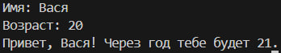

### Задание 2
```python
a = float(input("a: ").replace(',', '.'))
b = float(input("b: ").replace(',', '.'))
summ = a+b
average = round(summ / 2, 2)
print(f'sum={summ}; avg={average}')
```
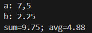

### Задание 3
```python
price = float(input())
discount = float(input())
vat = float(input())
base = price * (1 - discount/100)
vat_amount = base * (vat/100)
total = base + vat_amount
print(f'База после скидки: {base:.2f} ₽')
print(f'НДС:               {vat_amount:.2f} ₽')
print(f'Итого к оплате:    {total:.2f} ₽')
```
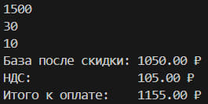

### Задание 4
```python
m = int(input('Минуты: '))
print(f'{int(m/60)}:{int(m%60):02d}')
```
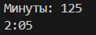

### Задание 5
```python
fio = input('ФИО: ').strip()
cl = ' '.join(fio.split())
ini = ''.join(x[0].upper() for x in cl.split())
print(f'Инициалы: {ini}\nДлина (символов): {len(cl)}')
```
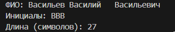

### Задание 6
```python
N = int(input())
ochn = 0
zaochn = 0
for i in range(N):
    inf = input().split()
    if inf[-1] == 'True':
        ochn += 1
    else:
        zaochn += 1
print(f'out: {ochn} {zaochn}')
```
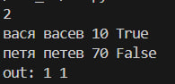 

### Задание 7
```python
n = input('in: ')
out = ''
for i in range(len(n)):
    if n[i].isupper():
        out += (n[i])
        for j in range(i, len(n)):
            if n[j].isdigit():
                out += n[j+1]
                out += n[j+1+j+1-i::j+1-i]
                break
print(f'out: {out}')
```
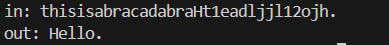

## Лабораторная работа 2

### Задание 1
```python 
def min_max(nums):
    try:
        if nums == []:
            raise ValueError
        
        minimum = nums[0]
        maximum = nums[0]

        for i in range(len(nums)):
            if nums[i] < minimum:
                minimum = nums[i]
            if nums[i] > maximum:
                maximum = nums[i]

        return (minimum, maximum)
    except Exception as err:
        return repr(err)
print('min_max')
print(min_max([3, -1, 5, 5, 0]))
print(min_max([42]))
print(min_max([-5, -2, -9]))
print(min_max([]))
print(min_max([1.5, 2, 2.0, -3.1]))

def unique_sorted(nums):
    if nums == []:
        return []
    
    unique = []
    for x in nums:
        if x not in unique:
            unique.append(x)

    n = len(unique)
    for i in range(n):
        for j in range(0, n-i-1):
            if unique[j] > unique[j+1]:
                unique[j], unique[j+1] = unique[j+1], unique[j]
    
    return unique

print('unique_sorted')
print(unique_sorted([3, 1, 2, 1, 3]))
print(unique_sorted([]))
print(unique_sorted([-1, -1, 0, 2, 2]))
print(unique_sorted([1.0, 1, 2.5, 2.5, 0]))

def flatten(mat):
    try:
        result = []
        for i in range(len(mat)):
            if type(mat[i]) != list and type(mat[i]) != tuple:
                raise ValueError
            
            for j in range(len(mat[i])):
                result.append(mat[i][j])
        
        return result
    except Exception as err:
        return repr(err)
print('flatten')
print(flatten([[1, 2], [3, 4]]))
print(flatten([[1, 2], (3, 4, 5)]))
print(flatten([[1], [], [2, 3]]))
print(flatten([[1, 2], "ab"]))
```
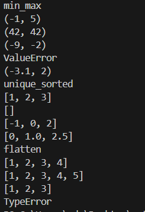

### Задание 2
```python
def transpose(mat):
    try:    
        if mat == []:
            return []
        
        n = len(mat[0])
        for i in range(len(mat)):
            if len(mat[i]) != n:
                raise ValueError
        
        new_mat = []
        for j in range(len(mat[0])):  
            new_row = []
            for i in range(len(mat)):  
                new_row.append(mat[i][j])
            new_mat.append(new_row)
        
        return new_mat
    except Exception as err:
        return repr(err)   
print('transpose')
print(transpose([[1, 2, 3]]))
print(transpose([[1], [2], [3]]))
print(transpose([[1, 2], [3, 4]]))
print(transpose([]))
print(transpose([[1, 2], [3]]))


def row_sums(mat):
    try:
        if mat == []:
            return []
        
        n = len(mat[0])
        for i in range(len(mat)):
            if len(mat[i]) != n:
                raise ValueError
        
        sums = []
        for i in range(len(mat)):
            s = 0
            for j in range(len(mat[i])):
                s = s + mat[i][j]
            sums.append(s)
        
        return sums
    except Exception as err:
        return repr(err)
print('row_sums')
print(row_sums([[1, 2, 3], [4, 5, 6]]))
print(row_sums([[-1, 1], [10, -10]]))
print(row_sums([[0, 0], [0, 0]]))
print(row_sums([[1, 2], [3]]))


def col_sums(mat):
    try:
        if mat == []:
            return []
        
        n = len(mat[0])
        for i in range(len(mat)):
            if len(mat[i]) != n:
                raise ValueError
        
        sums = []
        for j in range(len(mat[0])):  
            s = 0
            for i in range(len(mat)):  
                s = s + mat[i][j]
            sums.append(s)
        
        return sums
    except Exception as err:
        return repr(err)
print('col_sums')
print(col_sums([[1, 2, 3], [4, 5, 6]]))
print(col_sums([[-1, 1], [10, -10]]))
print(col_sums([[0, 0], [0, 0]]))
print(col_sums([[1, 2], [3]]))
```
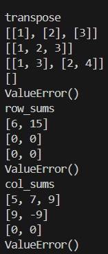

### Задание 3
```python
def format_record(rec):
    try:
        fio = rec[0]
        group = rec[1]
        gpa = rec[2]
        
        if fio == "" or group == "":
            raise(ValueError)
        
        if not isinstance(gpa, (int, float)):
            raise(TypeError)
        
        fio_parts = fio.split()
        fio_parts = [p.strip() for p in fio_parts]
        
        if len(fio_parts) == 3:
            initials = fio_parts[1][0].upper() + "." + fio_parts[2][0].upper() + "."
        elif len(fio_parts) == 2:
            initials = fio_parts[1][0].upper() + "."
        else:
            raise(ValueError)
        
        gpa_str = str(round(gpa, 2))
        if "." in gpa_str:
            parts = gpa_str.split(".")
            if len(parts[1]) == 1:
                gpa_str = gpa_str + "0" 
        else:
            gpa_str = gpa_str + ".00"
        
        surname = fio_parts[0].capitalize() 
        
        result = surname + " " + initials + ", гр. " + group + ", GPA " + gpa_str
        return result
    except Exception as err:
        return repr(err)

print('format_record')
print(format_record(("Иванов Иван Иванович", "BIVT-25", 4.6)))
print(format_record(("Петров Пётр", "IKBO-12", 5.0)))
print(format_record(("Петров Пётр Петрович", "IKBO-12", 5.0)))
print(format_record(("  сидорова  анна   сергеевна ", "ABB-01", 3.999)))
print(format_record(("", "BIVT-25", 4.0)))  # пустое фио

```
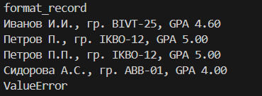

## Лабораторная работа 3

### Задание A
```python 
import re
def normalize(text: str, *, casefold: bool = True, yo2e: bool = True) -> str:
    if casefold:
        text = text.casefold()
    if yo2e:
        text.replace('Ё', 'е').replace('ё', 'е')
    text = re.sub(r'[\t\r\n]', ' ', text) # регулярное выражение ищущее \t\r\n и заменяющее на пробел
    text = re.sub(r' +', ' ', text) #' +' - от одного пробела и больше
    return text.strip()

print(normalize("ПрИвЕт\nМИр\t"))
print(normalize("ёжик, Ёлка"))
print(normalize("Hello\r\nWorld"))
print(normalize("  двойные   пробелы  "))

def tokenize(text: str) -> list[str]:
    text = normalize(text)
    return re.findall(r'\w+(?:-\w+)*', text) # регулярное выражение для поиска слов

print(tokenize("привет мир"))
print(tokenize("hello,world!!!"))
print(tokenize("по-настоящему круто"))
print(tokenize("2025 год"))
print(tokenize("emoji 😀 не слово"))

def count_freq(tokens: list[str]) -> dict[str, int]:
    freq_dict = {}
    for token in tokens:
        if token in freq_dict:
            freq_dict[token] += 1
        else:
            freq_dict[token] = 1
    sorted_dict = {}

    for item in sorted(freq_dict.items(), key=lambda x: (-x[1], x[0])):
        sorted_dict[item[0]] = item[1]

    return sorted_dict
def top_n(freq: dict[str, int], n: int = 5) -> list[tuple[str, int]]:
    sorted_items = sorted(freq.items(), key=lambda x: (-x[1], x[0]))
    return sorted_items[:n]
print(count_freq(["a","b","a","c","b","a"]))
print(count_freq(["bb","aa","bb","aa","cc"]))
print(top_n(count_freq(["a","b","a","c","b","a"]),n=2))
print(top_n(count_freq(["bb","aa","bb","aa","cc"]),n=2))
```
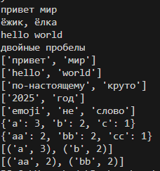
### Задание B
```python
import sys
from text import normalize, tokenize, count_freq, top_n

text = sys.stdin.read()
nt = normalize(text)
t = tokenize(nt)
f = count_freq(t)
top_words = top_n(f, 5)

print(f"Всего слов: {len(t)}")
print(f"Уникальных слов: {len(f)}")
print("Топ-5:")
for word, count in top_words:
    print(f"{word}: {count}")
```
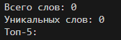

## Лабораторная работа 4

### Задание A
```python
from typing import Iterable, Sequence
import csv
from pathlib import Path

def read_text(path: str | Path, encoding: str = "utf-8") -> str: #изменить кодировку: encoding="cp1251"
    p = Path(path)
    return p.read_text(encoding=encoding)

def write_csv(rows: Iterable[Sequence], path: str | Path,
              header: tuple[str, ...] | None = None) -> None:
    p = Path(path)
    rows = list(rows)
    if rows:
        first_len = len(rows[0])
        for i, row in enumerate(rows):
            if len(row) != first_len:
                raise ValueError(f"Строка {i} имеет длину {len(row)}, ожидается {first_len}")
    
    # Проверка что заголовок соответствует длине строк
    if header and len(header) != len(rows[0]):
        raise ValueError(f"Заголовок имеет длину {len(header)}, а строки - {len(rows[0])}")
    
    with p.open("w", newline="", encoding="utf-8") as f:
        w = csv.writer(f)
        if header is not None:
            w.writerow(header)
        w.writerows(rows)
from io_txt_csv import read_text, write_csv
txt = read_text("data/input.txt")  # должен вернуть строку
write_csv([("word","count"),("test",3)], "data/check.csv")  # создаст CSV
```
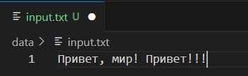
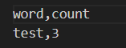

### Задание B
```python
import sys
from pathlib import Path

project_root = Path(__file__).parent.parent
sys.path.insert(0, str(project_root))

from lab_03.text import normalize, tokenize, count_freq, top_n
from lab_04.io_txt_csv import read_text, write_csv

def main():
    input_file="data/input.txt"
    output_file="data/report.csv"
    encoding="utf-8"
    with open(input_file, 'r', encoding=encoding) as f:
        text=f.read()
    text=normalize(text)
    words=tokenize(text)
    word_count=Counter(words)
    sorted_words=sorted(word_count.items(), key=lambda x: (-x[1], x[0]))
    with open(output_file, 'w', encoding='utf-8') as f:
        f.write("word,count\n")
        for word, count in sorted_words:
            f.write(f"{word},{count}\n")
    print(f"Всего слов: {len(words)}")
    print(f"Уникальных слов: {len(word_count)}")
    print("Топ-5:")
    for word, count in sorted_words[:5]:
        print(f"{word}:{count}")
main()
```
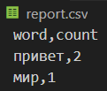
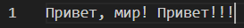
## Лабораторная работа 5

### Задание A
```python
import json
import csv
from pathlib import Path

def json_to_csv(json_path: str, csv_path: str) -> None:
    json_file = Path(json_path)
    if not json_file.exists():
        raise FileNotFoundError(f"Файл {json_path} не найден")

    with open(json_path, 'r', encoding='utf-8') as jf:
        try:
            data = json.load(jf)
        except json.JSONDecodeError:
            raise ValueError("Файл не является валидным JSON")

    if not isinstance(data, list):
        raise ValueError("JSON должен быть списком объектов")
    if len(data) == 0:
        raise ValueError("Пустой JSON или неподдерживаемая структура")
    if not all(isinstance(item, dict) for item in data):
        raise ValueError("Все элементы в списке должны быть словарями")

    fieldnames = list(data[0].keys())
    for item in data[1:]:
        for key in item.keys():
            if key not in fieldnames:
                fieldnames.append(key)

    with open(csv_path, 'w', newline='', encoding='utf-8') as cf:
        writer = csv.DictWriter(cf, fieldnames=fieldnames)
        writer.writeheader()
        for row in data:
            for key in fieldnames:
                row.setdefault(key, '')
            writer.writerow(row)

def csv_to_json(csv_path: str, json_path: str) -> None:

    csv_file = Path(csv_path)
    if not csv_file.exists():
        raise FileNotFoundError(f"Файл {csv_path} не найден")

    with open(csv_path, 'r', encoding='utf-8') as cf:
        reader = csv.DictReader(cf)
        if reader.fieldnames is None:
            raise ValueError("CSV файл пуст или не содержит заголовка")
        data = list(reader)

    if len(data) == 0:
        raise ValueError("CSV файл пуст")

    with open(json_path, 'w', encoding='utf-8') as jf:
        json.dump(data, jf, ensure_ascii=False, indent=2)
```
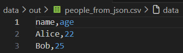
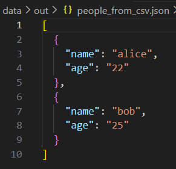

### Задание B
```python
import csv
from openpyxl import Workbook
from pathlib import Path

def csv_to_xlsx(csv_path: str, xlsx_path: str) -> None:
    """
    Конвертируем CSV в XLSX с помощью openpyxl.
    """
    #Проверяем, существует ли файл
    csv_file = Path(csv_path)
    if not csv_file.exists():
        raise FileNotFoundError(f"Файл {csv_path} не найден")

    with open(csv_path, 'r', encoding='utf-8') as cf:
        reader = csv.reader(cf)
        try:
            header = next(reader)
        except StopIteration:
            raise ValueError("CSV файл пуст")
        rows = list(reader)

    if len(header) == 0:
        raise ValueError("CSV файл не содержит заголовка")

    #Создаём новую Excel книгу
    wb = Workbook()
    ws = wb.active
    ws.title = "Sheet1"

    ws.append(header)

    for row in rows:
        ws.append(row)

    for col in ws.columns:
        max_length = 0
        column = col[0].column_letter
        
        for cell in col:
            try:
                if len(str(cell.value)) > max_length:
                    max_length = len(str(cell.value))
            except:
                pass
        
        #Минимальная ширина — 8 символов
        adjusted_width = max(max_length + 2, 8)
        ws.column_dimensions[column].width = adjusted_width

    #Сохраняем файл
    wb.save(xlsx_path)
```
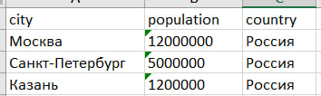

## Лабораторная работа 6

### Задание A
```python
import argparse
import sys
import os
sys.path.append('/Users/mda/Desktop/python_labs/src/lab_03')
from text import tokenize
from text import normalize
from text import count_freq
from text import top_n

def cat(input_path, number_lines):
    with open(input_path, 'r', encoding='utf-8') as file:
        for i, line in enumerate(file, 1):
            if number_lines:
                print(f"{i}:{line}", end='')

def stats(input_text, n=5):
    with open(input_text, 'r', encoding='utf-8') as f:
        text = f.read()
    tokens = tokenize(normalize(text))
    freq = count_freq(tokens)
    top_words = top_n(freq, n)

    for word, count in top_words:
        print(f"{word}: {count}")

def main():
    parser = argparse.ArgumentParser(description="CLI-утилиты лабораторной №6")
    subparsers = parser.add_subparsers(dest="command")

    # Подкоманда cat
    cat_parser = subparsers.add_parser("cat", help="Вывести содержимое файла")
    cat_parser.add_argument("--input", required=True, help="Путь к файлу")
    cat_parser.add_argument("-n", action="store_true", help="Нумеровать строки")

    # Подкоманда stats
    stats_parser = subparsers.add_parser("stats", help="Частоты слов в тексте")
    stats_parser.add_argument("--input", required=True, help="Путь к текстовому файлу")
    stats_parser.add_argument("--top", type=int, default=5, help="Количество слов в топе")

    args = parser.parse_args()

    if args.command == "cat":
        cat(args.input, args.n)
    if args.command == "stats":
        stats(args.input, args.top)


if __name__ == "__main__":
    main()
```
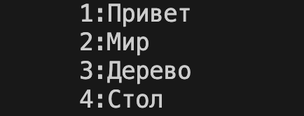
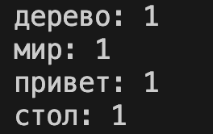

### Задание B
```python
import argparse
import os
import sys
sys.path.append('/Users/mda/Desktop/python_labs/src/lab05/')
from json_csv import json_to_csv
from json_csv import csv_to_json
from csv_xlsx import csv_to_xlsx

def json2csv(input_file, output_file):
    json_to_csv(input_file, output_file)

def csv2json(input_file, output_file):
    csv_to_json(input_file, output_file)

def csv2xlsx(input_file, output_file):
    csv_to_xlsx(input_file, output_file)

def main():
    parser = argparse.ArgumentParser(description="Конвертеры данных")
    subparsers = parser.add_subparsers(dest="cmd", required=True)

    # json2csv
    p1 = subparsers.add_parser("json2csv", help="Конвертировать JSON в CSV")
    p1.add_argument("--in", dest="input", required=True, help="Входной JSON файл")
    p1.add_argument("--out", dest="output", required=True, help="Выходной CSV файл")

    # csv2json
    p2 = subparsers.add_parser("csv2json", help="Конвертировать CSV в JSON")
    p2.add_argument("--in", dest="input", required=True, help="Входной CSV файл")
    p2.add_argument("--out", dest="output", required=True, help="Выходной JSON файл")

    # csv2xlsx
    p3 = subparsers.add_parser("csv2xlsx", help="Конвертировать CSV в XLSX")
    p3.add_argument("--in", dest="input", required=True, help="Входной CSV файл")
    p3.add_argument("--out", dest="output", required=True, help="Выходной XLSX файл")

    args = parser.parse_args()

    # Проверяем, существует ли входной файл
    if not os.path.exists(args.input):
        print(f"Ошибка: файл {args.input} не найден", file=sys.stderr)
        sys.exit(1)

    try:
        if args.cmd == "json2csv":
            json_to_csv(args.input, args.output)
        elif args.cmd == "csv2json":
            csv_to_json(args.input, args.output)
        elif args.cmd == "csv2xlsx":
            csv_to_xlsx(args.input, args.output)
        print("Готово!")
    except Exception as e:
        print(f"Ошибка при конвертации: {e}", file=sys.stderr)
        sys.exit(1)

if __name__ == "__main__":
    main()
```
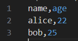
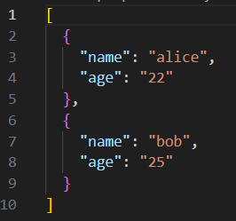
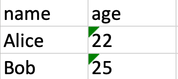

## Лабораторная работа 7


